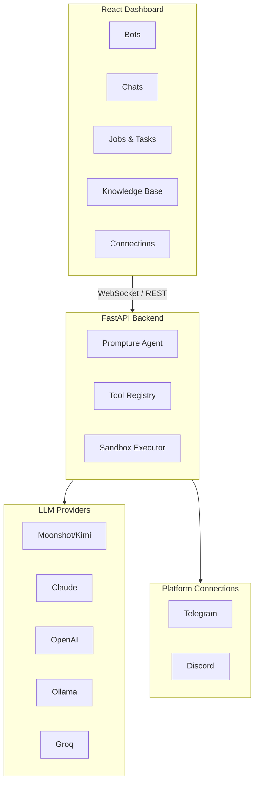

<div align="center">
  

  <h1>CachiBot</h1>

  <p><strong>The Armored AI Agent</strong></p>
  <p><em>Visual. Transparent. Secure.</em></p>

  <p>
    <a href="docs/README.es.md">Español</a> ·
    <a href="docs/README.zh-CN.md">中文版</a> ·
    <a href="docs/README.pt.md">Português</a>
  </p>

  <p>
    
    
    
  </p>

  <p>
    <a href="https://pypi.org/project/cachibot"></a>
    <a href="https://pypi.org/project/cachibot"></a>
    <a href="https://github.com/jhd3197/CachiBot/blob/main/LICENSE"></a>
    <a href="https://python.org"></a>
    <a href="https://react.dev"></a>
    <a href="https://github.com/jhd3197/CachiBot/stargazers"></a>
    <a href="https://discord.gg/V9bKwYVJ"></a>
  </p>

  <p>
    A visual AI agent platform with full transparency. Named after the Venezuelan <em>cachicamo</em> (armadillo) — built to be armored, auditable, and yours to control.
  </p>

  <p>
    <a href="#-quick-start">Quick Start</a> ·
    <a href="#-features">Features</a> ·
    <a href="#-architecture">Architecture</a> ·
    <a href="#-security">Security</a> ·
    <a href="#-contributing">Contributing</a> ·
    <a href="https://discord.gg/V9bKwYVJ">Discord</a>
  </p>

</div>

---

## Why Visual?

Most AI agents run in terminals where you can't see what's happening. That's a security nightmare.

CLI-based agents operate in a black box — no visibility into running tasks, no way to monitor multiple bots, no real-time insight into what the agent is doing.

**CachiBot gives you full visibility.** Watch your bots work through a dashboard, see every task and job in a clean interface, approve or reject actions before they execute, and maintain a full audit trail of everything your bots do.

<p align="center">
  
</p>

<p align="center">
  
</p>

## Features

- **Visual Dashboard** — See all your bots, their status, and activity at a glance
- **Real-time Monitoring** — Watch tasks and jobs execute with live WebSocket updates
- **Multi-Bot Management** — Create and manage multiple specialized bots
- **Platform Connections** — Connect bots to Telegram, Discord, and more
- **Knowledge Base** — Upload documents to give bots specialized knowledge
- **Secure Sandbox** — Code runs in isolation with AST-based risk analysis
- **Approval Flow** — Visual approval for risky operations before they execute
- **Multi-Provider** — Kimi K2.5, Claude, OpenAI, Ollama, Groq, and more

## Quick Start

### 1. Install

```bash
pip install cachibot
```

### 2. Set your API key

```bash
# Moonshot/Kimi (default)
export MOONSHOT_API_KEY="your-key"

# Or Claude
export ANTHROPIC_API_KEY="your-key"

# Or OpenAI
export OPENAI_API_KEY="your-key"
```

### 3. Launch

```bash
cachibot server
```

Open **http://localhost:6392** — the frontend is bundled and served automatically.

### CLI Usage

```bash
cachibot server                              # Start the dashboard
cachibot "list all Python files"             # Run a single task
cachibot                                     # Interactive mode
cachibot --model anthropic/claude-sonnet-4-20250514 "explain this"  # Specific model
cachi server                                 # Short alias
```

## Architecture



## Supported Models

| Provider | Model | Environment Variable |
|----------|-------|---------------------|
| Moonshot | `moonshot/kimi-k2.5` | `MOONSHOT_API_KEY` |
| Claude | `anthropic/claude-sonnet-4-20250514` | `ANTHROPIC_API_KEY` |
| OpenAI | `openai/gpt-4o` | `OPENAI_API_KEY` |
| Ollama | `ollama/llama3.1:8b` | (local, no key needed) |
| Groq | `groq/llama-3.1-70b` | `GROQ_API_KEY` |

## Security

CachiBot is built with security as a core principle. **Visibility is security** — the biggest risk with AI agents is not knowing what they're doing.

### Sandboxed Execution

Python code runs in a restricted environment:

- **Import Restrictions** — Only safe modules allowed (json, math, datetime, etc.)
- **Path Restrictions** — File access limited to the workspace
- **Execution Timeout** — Code killed after timeout (default: 30s)
- **Risk Analysis** — AST-based detection of dangerous operations

### Always Blocked

These are never allowed regardless of configuration: `subprocess`, `os.system`, `ctypes`, `socket`, `ssl`, `importlib`, `eval`, `exec`, `pickle`, `marshal`.

## Roadmap

- [x] Visual dashboard with real-time monitoring
- [x] Multi-bot management
- [x] Sandboxed Python execution
- [x] Multi-provider LLM support
- [x] Knowledge base with document upload
- [x] Telegram integration
- [x] Discord integration
- [x] Plugin marketplace
- [ ] Voice interface
- [ ] Mobile companion app

## Contributing

Contributions are welcome!

```bash
git clone https://github.com/jhd3197/CachiBot.git
cd CachiBot

# Backend
pip install -e ".[dev]"
cachibot server --reload

# Frontend (in another terminal)
cd frontend && npm install && npm run dev

# Tests & linting
pytest
ruff check src/
cd frontend && npm run lint
```

## Community

<p align="center">
  <a href="https://discord.gg/V9bKwYVJ">
    
  </a>
  <a href="https://github.com/jhd3197/CachiBot/issues">
    
  </a>
</p>

## License

MIT License — see [LICENSE](LICENSE) for details.

## Credits

- Built with [Prompture](https://github.com/jhd3197/Prompture) for structured LLM interaction
- Named after the Venezuelan *cachicamo* (armadillo)

---

<p align="center">
  Made with care by <a href="https://juandenis.com">Juan Denis</a>
</p>
