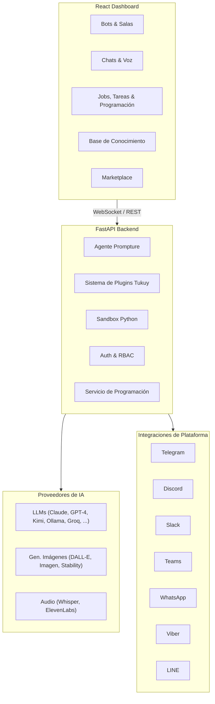

<div align="center">
  

  <h1>CachiBot</h1>

  <p><strong>El Agente de IA Blindado</strong></p>
  <p><em>Visual. Transparente. Seguro.</em></p>

  <p>
    <a href="../README.md">English</a> ·
    Español ·
    <a href="README.zh-CN.md">中文版</a> ·
    <a href="README.pt.md">Português</a>
  </p>

  <p>
    
    
    
  </p>

  <p>
    <a href="https://pypi.org/project/cachibot"></a>
    <a href="https://pypi.org/project/cachibot"></a>
    <a href="https://github.com/jhd3197/CachiBot/blob/main/LICENSE"></a>
    <a href="https://python.org"></a>
    <a href="https://react.dev"></a>
    <a href="https://github.com/jhd3197/CachiBot/stargazers"></a>
    <a href="https://discord.gg/V9bKwYVJ"></a>
  </p>

  <p>
    Una plataforma de agentes de IA visual con transparencia total. Nombrado en honor al <em>cachicamo</em> venezolano (armadillo) — construido para ser blindado, auditable y bajo tu control.
  </p>

  <p>
    <a href="#-instalación">Instalación</a> ·
    <a href="#-características">Características</a> ·
    <a href="#-arquitectura">Arquitectura</a> ·
    <a href="#-seguridad">Seguridad</a> ·
    <a href="#-contribuir">Contribuir</a> ·
    <a href="https://discord.gg/V9bKwYVJ">Discord</a>
  </p>

</div>

---

## ¿Por qué CachiBot?

La mayoría de las plataformas de IA te obligan a elegir: interfaces de chatbot sin automatización, constructores de workflows sin IA conversacional, o frameworks de desarrollo que toman semanas para producir algo.

**CachiBot te da los tres.** Crea bots especializados, despliégalos en cualquier plataforma de mensajería, ejecútalos en salas colaborativas y automatiza workflows — todo desde un tablero visual con transparencia total sobre lo que tus agentes están haciendo.

<p align="center">
  
</p>

<p align="center">
  
</p>

## Instalación

### Linux / macOS

```bash
curl -fsSL cachibot.ai/install.sh | bash
```

Configura Python, un entorno virtual y un servicio systemd — todo lo que necesitas en un solo comando.

### Windows

```powershell
irm cachibot.ai/install.ps1 | iex
```

### pip

```bash
pip install cachibot
```

Luego inicia el servidor:

```bash
cachibot server
```

Abre **http://localhost:6392** — el frontend viene empaquetado y se sirve automáticamente. No necesitas un paso de build separado.

### Configura tus claves API

Puedes configurar las claves API directamente desde la interfaz del tablero — no necesitas variables de entorno. Solo abre el panel de configuración y agrega tus claves ahí.

Si prefieres variables de entorno, también funcionan:

```bash
export OPENAI_API_KEY="tu-clave"       # OpenAI / GPT-4
export ANTHROPIC_API_KEY="tu-clave"    # Claude
export MOONSHOT_API_KEY="tu-clave"     # Kimi
# o usa Ollama localmente (no necesita clave)
```

### Uso de CLI

```bash
cachibot server                    # Inicia el tablero
cachibot "resume este proyecto"    # Ejecuta una tarea única
cachibot                           # Modo interactivo
cachi server                       # Alias corto
```

## Características

### Plataforma Multi-Agente

- **Bots Especializados Ilimitados** — Crea bots con prompts de sistema personalizados, selección de herramientas y enrutamiento de modelos
- **Salas Colaborativas** — Ejecuta 2-4 bots juntos en tiempo real para resolver tareas complejas
- **Marketplace de Bots** — Plantillas pre-construidas para casos de uso comunes (revisión de código, análisis de datos, escritura, soporte)

### Integraciones de Plataforma

Despliega bots en **7 plataformas de mensajería** con adaptadores integrados:

Telegram · Discord · Slack · Microsoft Teams · WhatsApp · Viber · LINE

### IA Multimodal

- **Conversaciones por Voz** — Habla con tus bots con speech-to-text y text-to-speech en tiempo real
- **Generación de Imágenes** — DALL-E, Google Imagen, Stability AI, Grok
- **Síntesis de Audio** — OpenAI TTS, ElevenLabs
- **12+ Proveedores de LLM** — Claude, GPT-4, Kimi, Gemini, Ollama, Groq y más

### 50+ Herramientas Integradas

Impulsado por plugins de [Tukuy](https://github.com/jhd3197/Tukuy):

- Operaciones de archivos, ejecución de Python en sandbox, búsqueda web
- Base de conocimiento con búsqueda vectorial y carga de documentos
- Gestión de tareas, programación (cron, intervalo, eventos), trabajos en segundo plano
- Operaciones Git, peticiones HTTP, consultas SQL
- Funciones reutilizables con dependencias a nivel de paso y reintentos

### Seguridad y Control

- **Flujos de Aprobación Visual** — Aprueba o rechaza operaciones riesgosas antes de que se ejecuten
- **Ejecución en Sandbox** — Python se ejecuta en aislamiento con análisis de riesgo basado en AST
- **Aislamiento de Workspace** — Todo acceso a archivos limitado al espacio de trabajo
- **Registro de Auditoría Completo** — Cada acción registrada y visible en el tablero

## ¿Qué Puedes Construir?

- **Bot de Soporte al Cliente** — Despliega en Telegram con una base de conocimiento de tus documentos, responde FAQs automáticamente
- **Sala de Análisis de Datos** — 3 bots (especialista SQL + analista Python + redactor de reportes) colaborando en insights
- **Asistente de Voz** — Habla con un bot con STT/TTS, gestiona tareas y recordatorios sin manos
- **Pipeline de Contenido** — Bot investigador + bot escritor + generador de imágenes produciendo posts de blog de principio a fin
- **Agente DevOps** — Monitorea repos, ejecuta scripts en sandbox, envía alertas a Slack programadas

## Arquitectura



## Proveedores Soportados

CachiBot usa [Prompture](https://github.com/jhd3197/Prompture) para gestión de modelos con auto-descubrimiento — configura una clave API y los modelos disponibles aparecen automáticamente.

| Proveedor | Modelos de Ejemplo | Variable de Entorno |
|-----------|-------------------|---------------------|
| OpenAI | GPT-4o, GPT-4, o1 | `OPENAI_API_KEY` |
| Anthropic | Claude Sonnet, Opus, Haiku | `ANTHROPIC_API_KEY` |
| Moonshot | Kimi K2.5 | `MOONSHOT_API_KEY` |
| Google | Gemini Pro, Flash | `GOOGLE_API_KEY` |
| Groq | Llama 3, Mixtral | `GROQ_API_KEY` |
| Grok/xAI | Grok-2 | `GROK_API_KEY` |
| Ollama | Cualquier modelo local | *(no necesita clave)* |

Todas las claves también se pueden configurar desde la interfaz del tablero sin tocar variables de entorno.

## Seguridad

CachiBot está construido con la seguridad como principio fundamental. **La visibilidad es seguridad** — el mayor riesgo con los agentes de IA es no saber qué están haciendo.

### Ejecución en Sandbox

El código Python se ejecuta en un entorno restringido:

- **Restricciones de Importación** — Solo se permiten módulos seguros (json, math, datetime, etc.)
- **Restricciones de Ruta** — Acceso a archivos limitado al workspace vía SecurityContext
- **Tiempo de Ejecución Límite** — El código se detiene después del timeout (predeterminado: 30s)
- **Análisis de Riesgo** — Puntuación basada en AST (SEGURO / MODERADO / PELIGROSO) antes de la ejecución
- **Flujo de Aprobación** — Operaciones peligrosas requieren aprobación explícita a través del tablero

### Siempre Bloqueado

Estos nunca se permiten independientemente de la configuración: `subprocess`, `os.system`, `ctypes`, `socket`, `ssl`, `importlib`, `eval`, `exec`, `pickle`, `marshal`.

## Hoja de Ruta

- [x] Tablero visual con monitoreo en tiempo real
- [x] Gestión multi-bot con plantillas de marketplace
- [x] Ejecución de Python en sandbox con análisis de riesgo AST
- [x] Soporte multi-proveedor de LLM (12+ proveedores)
- [x] Base de conocimiento con búsqueda vectorial y carga de documentos
- [x] 7 integraciones de plataforma (Telegram, Discord, Slack, Teams, WhatsApp, Viber, LINE)
- [x] Sistema de plugins con 50+ herramientas (vía Tukuy)
- [x] Salas colaborativas multi-agente
- [x] Conversaciones por voz (STT/TTS)
- [x] Generación de imágenes y audio
- [x] Trabajos en segundo plano con programación cron/intervalo/evento
- [x] Gestión de trabajo (tareas, todos, funciones)
- [x] Autenticación y control de acceso basado en roles
- [ ] Aplicación móvil complementaria

## Contribuir

¡Las contribuciones son bienvenidas! Consulta [CONTRIBUTING.md](../CONTRIBUTING.md) para la guía completa. Inicio rápido:

```bash
git clone https://github.com/jhd3197/CachiBot.git
cd CachiBot

# Backend
python -m venv venv && source venv/bin/activate  # o .\venv\Scripts\activate en Windows
pip install -e ".[dev]"

# Frontend
cd frontend && npm install && cd ..

# Desktop (opcional — solo si trabajas en el shell de Electron)
cd desktop && npm install && cd ..

# Ejecutar todo
bash dev.sh              # o .\dev.ps1 en Windows
bash dev.sh desktop      # con Electron
```

Consulta [CONTRIBUTING.md](../CONTRIBUTING.md) para todos los modos del script de desarrollo, estructura del proyecto, pruebas y guías de estilo de código.

## Comunidad

<p align="center">
  <a href="https://cachibot.ai">
    
  </a>
  <a href="https://discord.gg/V9bKwYVJ">
    
  </a>
  <a href="https://github.com/jhd3197/CachiBot/issues">
    
  </a>
</p>

## Licencia

Licencia MIT — ver [LICENSE](../LICENSE) para más detalles.

## Créditos

- Construido con [Prompture](https://github.com/jhd3197/Prompture) para interacción estructurada con LLM y controladores multimodales
- Sistema de plugins impulsado por [Tukuy](https://github.com/jhd3197/Tukuy)
- Nombrado en honor al *cachicamo* venezolano (armadillo)

---

<p align="center">
  Hecho con cariño por <a href="https://juandenis.com">Juan Denis</a>
</p>
