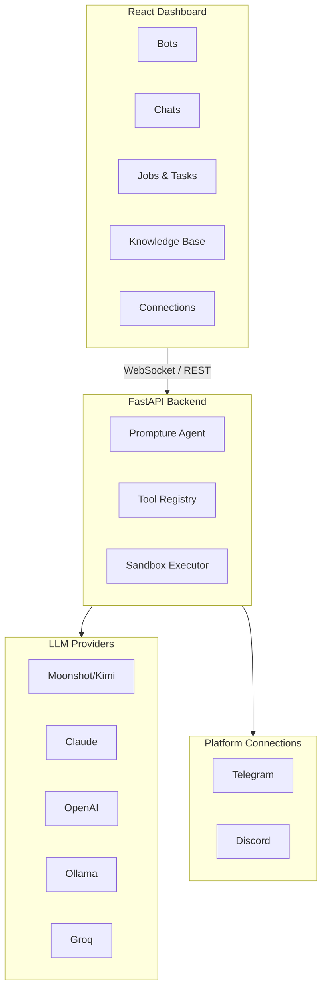

<div align="center">
  

  <h1>CachiBot</h1>

  <p><strong>El Agente de IA Blindado</strong></p>
  <p><em>Visual. Transparente. Seguro.</em></p>

  <p>
    <a href="../README.md">English</a> ·
    Español ·
    <a href="README.zh-CN.md">中文版</a> ·
    <a href="README.pt.md">Português</a>
  </p>

  <p>
    
    
    
  </p>

  <p>
    <a href="https://pypi.org/project/cachibot"></a>
    <a href="https://pypi.org/project/cachibot"></a>
    <a href="https://github.com/jhd3197/CachiBot/blob/main/LICENSE"></a>
    <a href="https://python.org"></a>
    <a href="https://react.dev"></a>
    <a href="https://github.com/jhd3197/CachiBot/stargazers"></a>
    <a href="https://discord.gg/V9bKwYVJ"></a>
  </p>

  <p>
    Una plataforma de agentes de IA visual con transparencia total. Nombrado en honor al <em>cachicamo</em> venezolano (armadillo) — construido para ser blindado, auditable y bajo tu control.
  </p>

  <p>
    <a href="#-inicio-rápido">Inicio Rápido</a> ·
    <a href="#-características">Características</a> ·
    <a href="#-arquitectura">Arquitectura</a> ·
    <a href="#-seguridad">Seguridad</a> ·
    <a href="#-contribuir">Contribuir</a> ·
    <a href="https://discord.gg/V9bKwYVJ">Discord</a>
  </p>

</div>

---

## ¿Por qué Visual?

La mayoría de los agentes de IA se ejecutan en terminales donde no puedes ver lo que está sucediendo. Eso es una pesadilla de seguridad.

Los agentes basados en CLI operan en una caja negra — sin visibilidad de las tareas en ejecución, sin forma de monitorear múltiples bots, sin información en tiempo real de lo que el agente está haciendo.

**CachiBot te da visibilidad completa.** Observa cómo trabajan tus bots a través de un tablero, ve cada tarea y trabajo en una interfaz limpia, aprueba o rechaza acciones antes de que se ejecuten, y mantén un registro de auditoría completo de todo lo que hacen tus bots.

<p align="center">
  
</p>

<p align="center">
  
</p>

## Características

- **Tablero Visual** — Ve todos tus bots, su estado y actividad de un vistazo
- **Monitoreo en Tiempo Real** — Observa la ejecución de tareas y trabajos con actualizaciones en vivo por WebSocket
- **Gestión Multi-Bot** — Crea y gestiona múltiples bots especializados
- **Conexiones de Plataforma** — Conecta bots a Telegram, Discord y más
- **Base de Conocimiento** — Sube documentos para dar conocimiento especializado a los bots
- **Sandbox Seguro** — El código se ejecuta aislado con análisis de riesgo basado en AST
- **Flujo de Aprobación** — Aprobación visual para operaciones riesgosas antes de ejecutarse
- **Multi-Proveedor** — Kimi K2.5, Claude, OpenAI, Ollama, Groq y más

## Inicio Rápido

### 1. Instalar

```bash
pip install cachibot
```

### 2. Configura tu clave API

```bash
# Moonshot/Kimi (predeterminado)
export MOONSHOT_API_KEY="tu-clave"

# O Claude
export ANTHROPIC_API_KEY="tu-clave"

# O OpenAI
export OPENAI_API_KEY="tu-clave"
```

### 3. Lanzar

```bash
cachibot server
```

Abre **http://localhost:6392** — el frontend viene empaquetado y se sirve automáticamente.

### Uso de CLI

```bash
cachibot server                              # Inicia el tablero
cachibot "listar todos los archivos Python"  # Ejecuta una tarea única
cachibot                                     # Modo interactivo
cachibot --model anthropic/claude-sonnet-4-20250514 "explica esto"  # Modelo específico
cachi server                                 # Alias corto
```

## Arquitectura



## Modelos Soportados

| Proveedor | Modelo | Variable de Entorno |
|----------|-------|---------------------|
| Moonshot | `moonshot/kimi-k2.5` | `MOONSHOT_API_KEY` |
| Claude | `anthropic/claude-sonnet-4-20250514` | `ANTHROPIC_API_KEY` |
| OpenAI | `openai/gpt-4o` | `OPENAI_API_KEY` |
| Ollama | `ollama/llama3.1:8b` | (local, sin clave necesaria) |
| Groq | `groq/llama-3.1-70b` | `GROQ_API_KEY` |

## Seguridad

CachiBot está construido con la seguridad como principio fundamental. **La visibilidad es seguridad** — el mayor riesgo con los agentes de IA es no saber qué están haciendo.

### Ejecución en Sandbox

El código Python se ejecuta en un entorno restringido:

- **Restricciones de Importación** — Solo se permiten módulos seguros (json, math, datetime, etc.)
- **Restricciones de Ruta** — Acceso a archivos limitado al espacio de trabajo
- **Tiempo de Ejecución Límite** — El código se detiene después del tiempo límite (predeterminado: 30s)
- **Análisis de Riesgo** — Detección basada en AST de operaciones peligrosas

### Siempre Bloqueado

Estos nunca se permiten independientemente de la configuración: `subprocess`, `os.system`, `ctypes`, `socket`, `ssl`, `importlib`, `eval`, `exec`, `pickle`, `marshal`.

## Hoja de Ruta

- [x] Tablero visual con monitoreo en tiempo real
- [x] Gestión multi-bot
- [x] Ejecución de Python en sandbox
- [x] Soporte multi-proveedor de LLM
- [x] Base de conocimiento con carga de documentos
- [x] Integración con Telegram
- [x] Integración con Discord
- [ ] Mercado de plugins
- [ ] Interfaz de voz
- [ ] Aplicación móvil complementaria

## Contribuir

¡Las contribuciones son bienvenidas!

```bash
git clone https://github.com/jhd3197/CachiBot.git
cd CachiBot

# Backend
pip install -e ".[dev]"
cachibot server --reload

# Frontend (en otra terminal)
cd frontend && npm install && npm run dev

# Pruebas y linting
pytest
ruff check src/
cd frontend && npm run lint
```

## Comunidad

<p align="center">
  <a href="https://discord.gg/V9bKwYVJ">
    
  </a>
  <a href="https://github.com/jhd3197/CachiBot/issues">
    
  </a>
</p>

## Licencia

Licencia MIT — ver [LICENSE](LICENSE) para más detalles.

## Créditos

- Construido con [Prompture](https://github.com/jhd3197/Prompture) para interacción estructurada con LLM
- Nombrado en honor al *cachicamo* venezolano (armadillo)

---

<p align="center">
  Hecho con cariño por <a href="https://juandenis.com">Juan Denis</a>
</p>
