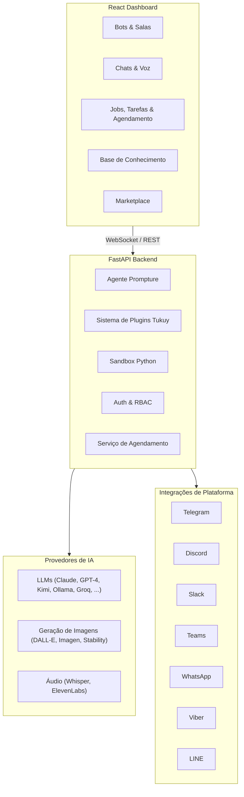

<div align="center">
  

  <h1>CachiBot</h1>

  <p><strong>O Agente de IA Blindado</strong></p>
  <p><em>Visual. Transparente. Seguro.</em></p>

  <p>
    <a href="../README.md">English</a> ·
    <a href="README.es.md">Español</a> ·
    <a href="README.zh-CN.md">中文版</a> ·
    Português
  </p>

  <p>
    
    
    
  </p>

  <p>
    <a href="https://pypi.org/project/cachibot"></a>
    <a href="https://pypi.org/project/cachibot"></a>
    <a href="https://github.com/jhd3197/CachiBot/blob/main/LICENSE"></a>
    <a href="https://python.org"></a>
    <a href="https://react.dev"></a>
    <a href="https://github.com/jhd3197/CachiBot/stargazers"></a>
    <a href="https://discord.gg/Xzw45fGhqq"></a>
  </p>

  <p>
    Uma plataforma de agentes de IA visual com total transparência. Nomeado em homenagem ao <em>cachicamo</em> venezuelano (tatu) — construído para ser blindado, auditável e seu para controlar.
  </p>

  <p>
    <a href="#-instalação">Instalação</a> ·
    <a href="#-recursos">Recursos</a> ·
    <a href="#-arquitetura">Arquitetura</a> ·
    <a href="#-segurança">Segurança</a> ·
    <a href="#-contribuindo">Contribuindo</a> ·
    <a href="https://discord.gg/Xzw45fGhqq">Discord</a>
  </p>

</div>

---

## Por que CachiBot?

A maioria das plataformas de IA te força a escolher: interfaces de chatbot sem automação, construtores de workflows sem IA conversacional, ou frameworks de desenvolvimento que levam semanas para entregar algo.

**CachiBot te dá os três.** Crie bots especializados, implante-os em qualquer plataforma de mensagens, execute-os em salas colaborativas e automatize workflows — tudo a partir de um painel visual com total transparência sobre o que seus agentes estão fazendo.

<p align="center">
  
</p>

<p align="center">
  
</p>

## Instalação

### Linux / macOS

```bash
curl -fsSL cachibot.ai/install.sh | bash
```

Configura Python, um ambiente virtual e um serviço systemd — tudo que você precisa em um único comando.

### Windows

```powershell
irm cachibot.ai/install.ps1 | iex
```

### pip

```bash
pip install cachibot
```

Depois inicie o servidor:

```bash
cachibot server
```

Abra **http://localhost:6392** — o frontend é empacotado e servido automaticamente. Nenhum passo de build separado necessário.

### Configure suas chaves de API

Você pode configurar as chaves de API diretamente pela interface do painel — sem necessidade de variáveis de ambiente. Basta abrir o painel de configurações e adicionar suas chaves lá.

Se preferir variáveis de ambiente, elas também funcionam:

```bash
export OPENAI_API_KEY="sua-chave"       # OpenAI / GPT-4
export ANTHROPIC_API_KEY="sua-chave"    # Claude
export MOONSHOT_API_KEY="sua-chave"     # Kimi
# ou use Ollama localmente (sem necessidade de chave)
```

### Uso via CLI

```bash
cachibot server                    # Inicia o painel
cachibot "resuma este projeto"     # Executa uma única tarefa
cachibot                           # Modo interativo
cachi server                       # Alias curto
```

## Recursos

### Plataforma Multi-Agente

- **Bots Especializados Ilimitados** — Crie bots com prompts de sistema personalizados, seleção de ferramentas e roteamento de modelos
- **Salas Colaborativas** — Execute 2-4 bots juntos em tempo real para resolver tarefas complexas
- **Marketplace de Bots** — Templates pré-construídos para casos de uso comuns (revisão de código, análise de dados, escrita, suporte)

### Integrações de Plataforma

Implante bots em **7 plataformas de mensagens** com adaptadores integrados:

Telegram · Discord · Slack · Microsoft Teams · WhatsApp · Viber · LINE

### IA Multimodal

- **Conversas por Voz** — Fale com seus bots com speech-to-text e text-to-speech em tempo real
- **Geração de Imagens** — DALL-E, Google Imagen, Stability AI, Grok
- **Síntese de Áudio** — OpenAI TTS, ElevenLabs
- **12+ Provedores de LLM** — Claude, GPT-4, Kimi, Gemini, Ollama, Groq e mais

### 50+ Ferramentas Integradas

Alimentado por plugins [Tukuy](https://github.com/jhd3197/Tukuy):

- Operações de arquivos, execução Python em sandbox, busca web
- Base de conhecimento com busca vetorial e upload de documentos
- Gerenciamento de tarefas, agendamento (cron, intervalo, eventos), jobs em segundo plano
- Operações Git, requisições HTTP, consultas SQL
- Funções reutilizáveis com dependências por etapa e retentativas

### Segurança e Controle

- **Fluxos de Aprovação Visual** — Aprove ou rejeite operações arriscadas antes que sejam executadas
- **Execução em Sandbox** — Python roda em isolamento com análise de risco baseada em AST
- **Isolamento de Workspace** — Todo acesso a arquivos limitado ao espaço de trabalho
- **Trilha de Auditoria Completa** — Cada ação registrada e visível no painel

## O Que Você Pode Construir?

- **Bot de Suporte ao Cliente** — Implante no Telegram com uma base de conhecimento dos seus docs, responda FAQs automaticamente
- **Sala de Análise de Dados** — 3 bots (especialista SQL + analista Python + redator de relatórios) colaborando em insights
- **Assistente de Voz** — Fale com um bot com STT/TTS, gerencie tarefas e lembretes sem usar as mãos
- **Pipeline de Conteúdo** — Bot pesquisador + bot escritor + gerador de imagens produzindo posts de blog de ponta a ponta
- **Agente DevOps** — Monitore repos, execute scripts em sandbox, envie alertas para o Slack por agendamento

## Arquitetura



## Provedores Suportados

CachiBot usa [Prompture](https://github.com/jhd3197/Prompture) para gerenciamento de modelos com auto-descoberta — configure uma chave de API e os modelos disponíveis aparecem automaticamente.

| Provedor | Modelos de Exemplo | Variável de Ambiente |
|----------|-------------------|---------------------|
| OpenAI | GPT-4o, GPT-4, o1 | `OPENAI_API_KEY` |
| Anthropic | Claude Sonnet, Opus, Haiku | `ANTHROPIC_API_KEY` |
| Moonshot | Kimi K2.5 | `MOONSHOT_API_KEY` |
| Google | Gemini Pro, Flash | `GOOGLE_API_KEY` |
| Groq | Llama 3, Mixtral | `GROQ_API_KEY` |
| Grok/xAI | Grok-2 | `GROK_API_KEY` |
| Ollama | Qualquer modelo local | *(sem necessidade de chave)* |

Todas as chaves também podem ser configuradas pela interface do painel sem tocar em variáveis de ambiente.

## Segurança

CachiBot é construído com segurança como princípio fundamental. **Visibilidade é segurança** — o maior risco com agentes de IA é não saber o que eles estão fazendo.

### Execução em Sandbox

Código Python roda num ambiente restrito:

- **Restrições de Importação** — Apenas módulos seguros permitidos (json, math, datetime, etc.)
- **Restrições de Caminho** — Acesso a arquivos limitado ao workspace via SecurityContext
- **Timeout de Execução** — Código encerrado após timeout (padrão: 30s)
- **Análise de Risco** — Pontuação baseada em AST (SEGURO / MODERADO / PERIGOSO) antes da execução
- **Fluxo de Aprovação** — Operações perigosas requerem aprovação explícita pelo painel

### Sempre Bloqueado

Estes nunca são permitidos independentemente da configuração: `subprocess`, `os.system`, `ctypes`, `socket`, `ssl`, `importlib`, `eval`, `exec`, `pickle`, `marshal`.

## Roteiro

- [x] Painel visual com monitoramento em tempo real
- [x] Gerenciamento multi-bot com templates de marketplace
- [x] Execução Python em sandbox com análise de risco AST
- [x] Suporte multi-provedor de LLM (12+ provedores)
- [x] Base de conhecimento com busca vetorial e upload de documentos
- [x] 7 integrações de plataforma (Telegram, Discord, Slack, Teams, WhatsApp, Viber, LINE)
- [x] Sistema de plugins com 50+ ferramentas (via Tukuy)
- [x] Salas colaborativas multi-agente
- [x] Conversas por voz (STT/TTS)
- [x] Geração de imagens e áudio
- [x] Jobs em segundo plano com agendamento cron/intervalo/evento
- [x] Gerenciamento de trabalho (tarefas, todos, funções)
- [x] Autenticação e controle de acesso baseado em papéis
- [ ] App mobile complementar

## Contribuindo

Contribuições são bem-vindas! Veja [CONTRIBUTING.md](../CONTRIBUTING.md) para o guia completo. Início rápido:

```bash
git clone https://github.com/jhd3197/CachiBot.git
cd CachiBot

# Backend
python -m venv venv && source venv/bin/activate  # ou .\venv\Scripts\activate no Windows
pip install -e ".[dev]"

# Frontend
cd frontend && npm install && cd ..

# Desktop (opcional — apenas se estiver trabalhando no shell Electron)
cd desktop && npm install && cd ..

# Executar tudo
bash dev.sh              # ou .\dev.ps1 no Windows
bash dev.sh desktop      # com Electron
```

Veja [CONTRIBUTING.md](../CONTRIBUTING.md) para todos os modos do script de desenvolvimento, estrutura do projeto, testes e guias de estilo de código.

## Comunidade

<p align="center">
  <a href="https://cachibot.ai">
    
  </a>
  <a href="https://discord.gg/Xzw45fGhqq">
    
  </a>
  <a href="https://github.com/jhd3197/CachiBot/issues">
    
  </a>
</p>

## Licença

Licença MIT — veja [LICENSE](../LICENSE) para detalhes.

## Créditos

- Construído com [Prompture](https://github.com/jhd3197/Prompture) para interação estruturada com LLM e drivers multimodais
- Sistema de plugins alimentado por [Tukuy](https://github.com/jhd3197/Tukuy)
- Nomeado em homenagem ao *cachicamo* venezuelano (tatu)

---

<p align="center">
  Feito com carinho por <a href="https://juandenis.com">Juan Denis</a>
</p>
