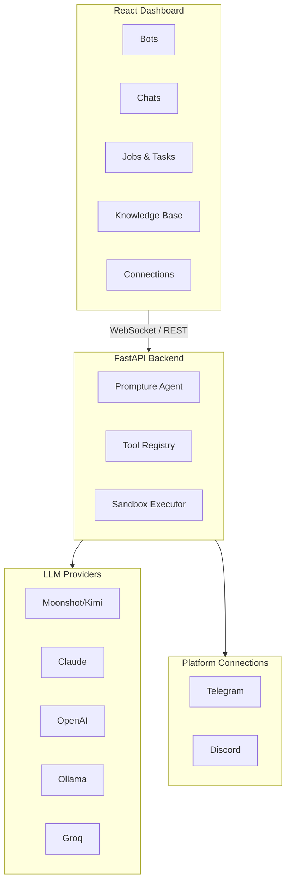

<div align="center">
  

  <h1>CachiBot</h1>

  <p><strong>O Agente de IA Blindado</strong></p>
  <p><em>Visual. Transparente. Seguro.</em></p>

  <p>
    <a href="../README.md">English</a> ·
    <a href="README.es.md">Español</a> ·
    <a href="README.zh-CN.md">中文版</a> ·
    Português
  </p>

  <p>
    
    
    
  </p>

  <p>
    <a href="https://pypi.org/project/cachibot"></a>
    <a href="https://pypi.org/project/cachibot"></a>
    <a href="https://github.com/jhd3197/CachiBot/blob/main/LICENSE"></a>
    <a href="https://python.org"></a>
    <a href="https://react.dev"></a>
    <a href="https://github.com/jhd3197/CachiBot/stargazers"></a>
    <a href="https://discord.gg/V9bKwYVJ"></a>
  </p>

  <p>
    Uma plataforma de agentes de IA visual com total transparência. Nomeado em homenagem ao <em>cachicamo</em> venezuelano (tatu) — construído para ser blindado, auditável e seu para controlar.
  </p>

  <p>
    <a href="#-início-rápido">Início Rápido</a> ·
    <a href="#-recursos">Recursos</a> ·
    <a href="#-arquitetura">Arquitetura</a> ·
    <a href="#-segurança">Segurança</a> ·
    <a href="#-contribuindo">Contribuindo</a> ·
    <a href="https://discord.gg/V9bKwYVJ">Discord</a>
  </p>

</div>

---

## Por que Visual?

A maioria dos agentes de IA roda em terminais onde você não consegue ver o que está acontecendo. Isso é um pesadelo de segurança.

Agentes baseados em CLI operam numa caixa preta — sem visibilidade das tarefas em execução, sem forma de monitorar múltiplos bots, sem insight em tempo real sobre o que o agente está fazendo.

**CachiBot te dá visibilidade total.** Observe seus bots trabalhando através de um painel, veja cada tarefa e job numa interface limpa, aprove ou rejeite ações antes que elas sejam executadas, e mantenha um registro completo de auditoria de tudo que seus bots fazem.

<p align="center">
  
</p>

<p align="center">
  
</p>

## Recursos

- **Painel Visual** — Veja todos os seus bots, seu status e atividade de relance
- **Monitoramento em Tempo Real** — Observe tarefas e jobs executarem com atualizações WebSocket ao vivo
- **Gerenciamento Multi-Bot** — Crie e gerencie múltiplos bots especializados
- **Conexões de Plataforma** — Conecte bots ao Telegram, Discord e mais
- **Base de Conhecimento** — Faça upload de documentos para dar conhecimento especializado aos bots
- **Sandbox Seguro** — Código roda em isolamento com análise de risco baseada em AST
- **Fluxo de Aprovação** — Aprovação visual para operações arriscadas antes da execução
- **Multi-Provedor** — Kimi K2.5, Claude, OpenAI, Ollama, Groq e mais

## Início Rápido

### 1. Instalar

```bash
pip install cachibot
```

### 2. Definir sua chave de API

```bash
# Moonshot/Kimi (padrão)
export MOONSHOT_API_KEY="sua-chave"

# Ou Claude
export ANTHROPIC_API_KEY="sua-chave"

# Ou OpenAI
export OPENAI_API_KEY="sua-chave"
```

### 3. Iniciar

```bash
cachibot server
```

Abra **http://localhost:6392** — o frontend é empacotado e servido automaticamente.

### Uso via CLI

```bash
cachibot server                              # Inicia o painel
cachibot "listar todos os arquivos Python"   # Executa uma única tarefa
cachibot                                     # Modo interativo
cachibot --model anthropic/claude-sonnet-4-20250514 "explique isso"  # Modelo específico
cachi server                                 # Alias curto
```

## Arquitetura



## Modelos Suportados

| Provedor | Modelo | Variável de Ambiente |
|----------|--------|---------------------|
| Moonshot | `moonshot/kimi-k2.5` | `MOONSHOT_API_KEY` |
| Claude | `anthropic/claude-sonnet-4-20250514` | `ANTHROPIC_API_KEY` |
| OpenAI | `openai/gpt-4o` | `OPENAI_API_KEY` |
| Ollama | `ollama/llama3.1:8b` | (local, não precisa de chave) |
| Groq | `groq/llama-3.1-70b` | `GROQ_API_KEY` |

## Segurança

CachiBot é construído com segurança como princípio fundamental. **Visibilidade é segurança** — o maior risco com agentes de IA é não saber o que eles estão fazendo.

### Execução em Sandbox

Código Python roda num ambiente restrito:

- **Restrições de Importação** — Apenas módulos seguros permitidos (json, math, datetime, etc.)
- **Restrições de Caminho** — Acesso a arquivos limitado ao workspace
- **Timeout de Execução** — Código encerrado após timeout (padrão: 30s)
- **Análise de Risco** — Detecção baseada em AST de operações perigosas

### Sempre Bloqueado

Estes nunca são permitidos independentemente da configuração: `subprocess`, `os.system`, `ctypes`, `socket`, `ssl`, `importlib`, `eval`, `exec`, `pickle`, `marshal`.

## Roteiro

- [x] Painel visual com monitoramento em tempo real
- [x] Gerenciamento multi-bot
- [x] Execução Python em sandbox
- [x] Suporte multi-provedor de LLM
- [x] Base de conhecimento com upload de documentos
- [x] Integração com Telegram
- [x] Integração com Discord
- [ ] Marketplace de plugins
- [ ] Interface de voz
- [ ] App mobile complementar

## Contribuindo

Contribuições são bem-vindas!

```bash
git clone https://github.com/jhd3197/CachiBot.git
cd CachiBot

# Backend
pip install -e ".[dev]"
cachibot server --reload

# Frontend (em outro terminal)
cd frontend && npm install && npm run dev

# Testes e linting
pytest
ruff check src/
cd frontend && npm run lint
```

## Comunidade

<p align="center">
  <a href="https://discord.gg/V9bKwYVJ">
    
  </a>
  <a href="https://github.com/jhd3197/CachiBot/issues">
    
  </a>
</p>

## Licença

Licença MIT — veja [LICENSE](LICENSE) para detalhes.

## Créditos

- Construído com [Prompture](https://github.com/jhd3197/Prompture) para interação estruturada com LLM
- Nomeado em homenagem ao *cachicamo* venezuelano (tatu)

---

<p align="center">
  Feito com carinho por <a href="https://juandenis.com">Juan Denis</a>
</p>
