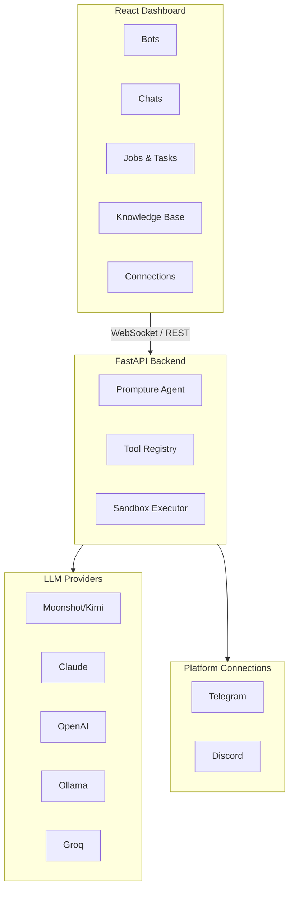

<div align="center">
  

  <h1>CachiBot</h1>

  <p><strong>铠甲 AI 智能体</strong></p>
  <p><em>可视化。透明。安全。</em></p>

  <p>
    <a href="../README.md">English</a> ·
    <a href="README.es.md">Español</a> ·
    中文版 ·
    <a href="README.pt.md">Português</a>
  </p>

  <p>
    
    
    
  </p>

  <p>
    <a href="https://pypi.org/project/cachibot"></a>
    <a href="https://pypi.org/project/cachibot"></a>
    <a href="https://github.com/jhd3197/CachiBot/blob/main/LICENSE"></a>
    <a href="https://python.org"></a>
    <a href="https://react.dev"></a>
    <a href="https://github.com/jhd3197/CachiBot/stargazers"></a>
    <a href="https://discord.gg/V9bKwYVJ"></a>
  </p>

  <p>
    一个完全透明的可视化 AI 智能体平台。以委内瑞拉的犰狳（西班牙语：<em>cachicamo</em>）命名——如铠甲般安全、可审计、完全由你掌控。
  </p>

  <p>
    <a href="#-快速开始">快速开始</a> ·
    <a href="#-功能特性">功能特性</a> ·
    <a href="#-架构">架构</a> ·
    <a href="#-安全性">安全性</a> ·
    <a href="#-贡献">贡献</a> ·
    <a href="https://discord.gg/V9bKwYVJ">Discord</a>
  </p>

</div>

---

## 为什么需要可视化？

大多数 AI 智能体在终端中运行，你无法看到正在发生什么。这是一个安全噩梦。

基于命令行的智能体在黑盒中运行——无法看到正在运行的任务、无法监控多个机器人、无法实时了解智能体正在做什么。

**CachiBot 为你提供完全的可见性。** 通过仪表板观察你的机器人工作，在简洁的界面中查看每个任务和作业，在操作执行前批准或拒绝，并维护机器人所做一切的完整审计追踪。

<p align="center">
  
</p>

<p align="center">
  
</p>

## 功能特性

- **可视化仪表板** — 一目了然地查看所有机器人的状态和活动
- **实时监控** — 通过 WebSocket 实时更新观察任务和作业执行
- **多机器人管理** — 创建和管理多个专用机器人
- **平台连接** — 将机器人连接到 Telegram、Discord 等平台
- **知识库** — 上传文档为机器人提供专业知识
- **安全沙箱** — 代码在隔离环境中运行，具备基于 AST 的风险分析
- **审批流程** — 危险操作执行前的可视化审批
- **多模型提供商** — 支持 Kimi K2.5、Claude、OpenAI、Ollama、Groq 等

## 快速开始

### 1. 安装

```bash
pip install cachibot
```

### 2. 设置你的 API 密钥

```bash
# Moonshot/Kimi（默认）
export MOONSHOT_API_KEY="your-key"

# 或者 Claude
export ANTHROPIC_API_KEY="your-key"

# 或者 OpenAI
export OPENAI_API_KEY="your-key"
```

### 3. 启动

```bash
cachibot server
```

打开 **http://localhost:6392** — 前端已打包并自动提供服务。

### 命令行用法

```bash
cachibot server                              # 启动仪表板
cachibot "list all Python files"             # 运行单个任务
cachibot                                     # 交互模式
cachibot --model anthropic/claude-sonnet-4-20250514 "explain this"  # 指定模型
cachi server                                 # 短别名
```

## 架构



## 支持的模型

| 提供商 | 模型 | 环境变量 |
|----------|-------|---------------------|
| Moonshot | `moonshot/kimi-k2.5` | `MOONSHOT_API_KEY` |
| Claude | `anthropic/claude-sonnet-4-20250514` | `ANTHROPIC_API_KEY` |
| OpenAI | `openai/gpt-4o` | `OPENAI_API_KEY` |
| Ollama | `ollama/llama3.1:8b` | （本地运行，无需密钥） |
| Groq | `groq/llama-3.1-70b` | `GROQ_API_KEY` |

## 安全性

CachiBot 以安全性为核心原则构建。**可见性即是安全性** — AI 智能体最大的风险是不知道它们在做什么。

### 沙箱执行

Python 代码在受限环境中运行：

- **导入限制** — 仅允许安全模块（json、math、datetime 等）
- **路径限制** — 文件访问仅限于工作空间
- **执行超时** — 超时后终止代码（默认：30 秒）
- **风险分析** — 基于 AST 的危险操作检测

### 始终被阻止

无论配置如何，这些操作始终不被允许：`subprocess`、`os.system`、`ctypes`、`socket`、`ssl`、`importlib`、`eval`、`exec`、`pickle`、`marshal`。

## 路线图

- [x] 具有实时监控的可视化仪表板
- [x] 多机器人管理
- [x] 沙箱化 Python 执行
- [x] 多提供商 LLM 支持
- [x] 带文档上传的知识库
- [x] Telegram 集成
- [x] Discord 集成
- [ ] 插件市场
- [ ] 语音界面
- [ ] 移动伴侣应用

## 贡献

欢迎贡献！

```bash
git clone https://github.com/jhd3197/CachiBot.git
cd CachiBot

# 后端
pip install -e ".[dev]"
cachibot server --reload

# 前端（在另一个终端）
cd frontend && npm install && npm run dev

# 测试和代码检查
pytest
ruff check src/
cd frontend && npm run lint
```

## 社区

<p align="center">
  <a href="https://discord.gg/V9bKwYVJ">
    
  </a>
  <a href="https://github.com/jhd3197/CachiBot/issues">
    
  </a>
</p>

## 许可证

MIT 许可证 — 详见 [LICENSE](LICENSE)。

## 致谢

- 使用 [Prompture](https://github.com/jhd3197/Prompture) 构建，用于结构化的 LLM 交互
- 以委内瑞拉的犰狳（西班牙语：*cachicamo*）命名

---

<p align="center">
  用心打造 by <a href="https://juandenis.com">Juan Denis</a>
</p>
