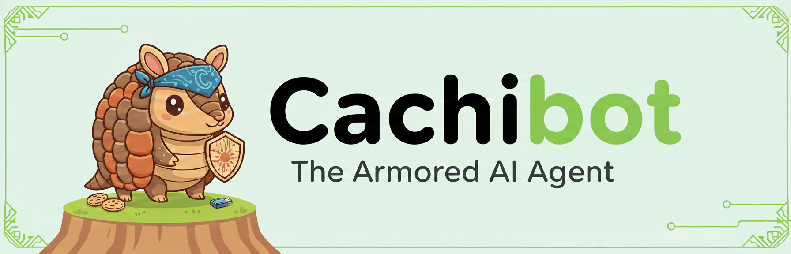
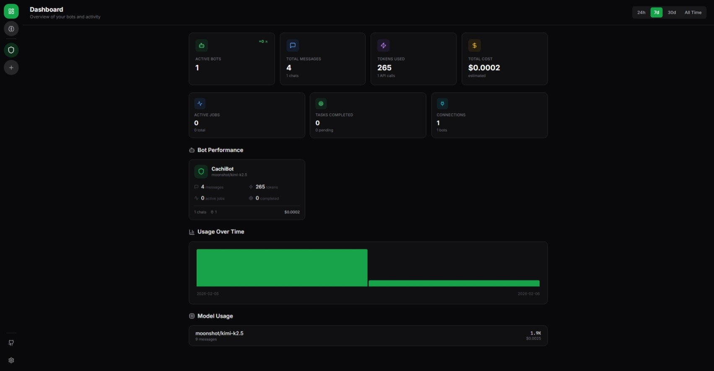
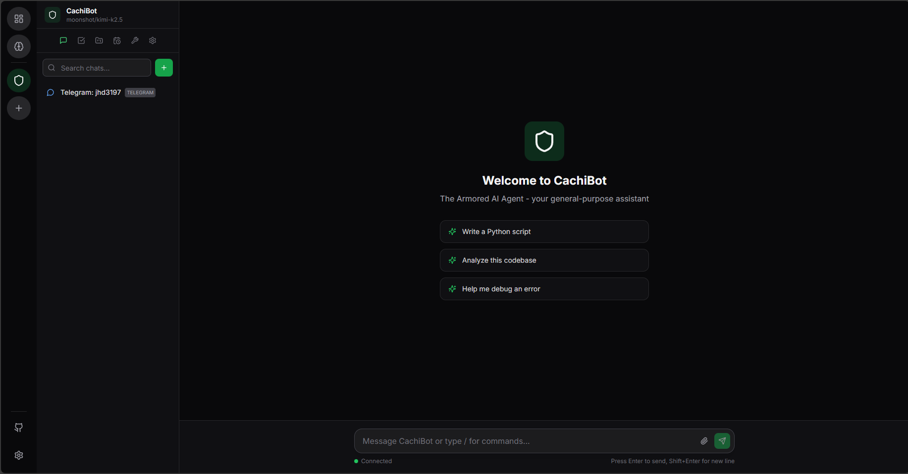
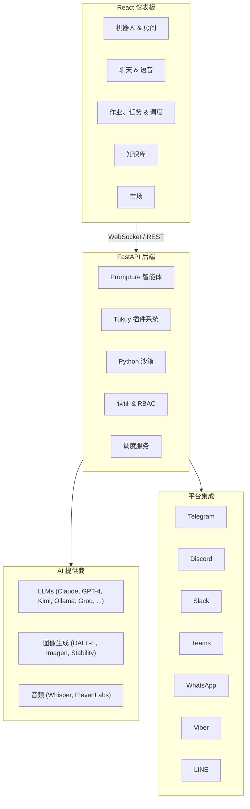

<div align="center">
  

  <h1>CachiBot</h1>

  <p><strong>铠甲 AI 智能体</strong></p>
  <p><em>可视化。透明。安全。</em></p>

  <p>
    <a href="../README.md">English</a> ·
    <a href="README.es.md">Español</a> ·
    中文版 ·
    <a href="README.pt.md">Português</a>
  </p>

  <p>
    
    
    
  </p>

  <p>
    <a href="https://pypi.org/project/cachibot"></a>
    <a href="https://pypi.org/project/cachibot"></a>
    <a href="https://github.com/jhd3197/CachiBot/blob/main/LICENSE"></a>
    <a href="https://python.org"></a>
    <a href="https://react.dev"></a>
    <a href="https://github.com/jhd3197/CachiBot/stargazers"></a>
    <a href="https://discord.gg/Xzw45fGhqq"></a>
  </p>

  <p>
    一个完全透明的可视化 AI 智能体平台。以委内瑞拉的犰狳（西班牙语：<em>cachicamo</em>）命名——如铠甲般安全、可审计、完全由你掌控。
  </p>

  <p>
    <a href="#-安装">安装</a> ·
    <a href="#-功能特性">功能特性</a> ·
    <a href="#-架构">架构</a> ·
    <a href="#-安全性">安全性</a> ·
    <a href="#-贡献">贡献</a> ·
    <a href="https://discord.gg/Xzw45fGhqq">Discord</a>
  </p>

</div>

---

## 为什么选择 CachiBot？

大多数 AI 平台迫使你做出选择：没有自动化的聊天机器人界面、没有对话式 AI 的工作流构建器、或者需要数周才能上线的开发框架。

**CachiBot 三者兼得。** 创建专业机器人、部署到任何消息平台、在协作房间中运行，以及自动化工作流——一切都通过可视化仪表板完成，完全透明地了解你的智能体在做什么。

<p align="center">
  
</p>

<p align="center">
  
</p>

## 安装

### Linux / macOS

```bash
curl -fsSL cachibot.ai/install.sh | bash
```

自动配置 Python、虚拟环境和 systemd 服务——一条命令搞定一切。

### Windows

```powershell
irm cachibot.ai/install.ps1 | iex
```

### pip

```bash
pip install cachibot
```

然后启动服务器：

```bash
cachibot server
```

打开 **http://localhost:6392** — 前端已打包并自动提供服务。无需单独的构建步骤。

### 配置 API 密钥

你可以直接在仪表板界面中配置 API 密钥——无需设置环境变量。只需打开设置面板，在那里添加你的密钥即可。

如果你更喜欢使用环境变量，也同样支持：

```bash
export OPENAI_API_KEY="your-key"       # OpenAI / GPT-4
export ANTHROPIC_API_KEY="your-key"    # Claude
export MOONSHOT_API_KEY="your-key"     # Kimi
# 或者使用本地 Ollama（无需密钥）
```

### 命令行用法

```bash
cachibot server                    # 启动仪表板
cachibot "总结这个项目"              # 运行单个任务
cachibot                           # 交互模式
cachi server                       # 短别名
```

## 功能特性

### 多智能体平台

- **无限专业机器人** — 创建具有自定义系统提示词、工具选择和模型路由的机器人
- **协作房间** — 让 2-4 个机器人实时协作解决复杂任务
- **机器人市场** — 常见用例的预建模板（代码审查、数据分析、写作、客服）

### 平台集成

通过内置适配器将机器人部署到 **7 个消息平台**：

Telegram · Discord · Slack · Microsoft Teams · WhatsApp · Viber · LINE

### 多模态 AI

- **语音对话** — 通过实时语音转文本和文本转语音与你的机器人对话
- **图像生成** — DALL-E、Google Imagen、Stability AI、Grok
- **音频合成** — OpenAI TTS、ElevenLabs
- **12+ LLM 提供商** — Claude、GPT-4、Kimi、Gemini、Ollama、Groq 等

### 50+ 内置工具

由 [Tukuy](https://github.com/jhd3197/Tukuy) 插件驱动：

- 文件操作、沙箱化 Python 执行、网络搜索
- 带向量搜索和文档上传的知识库
- 任务管理、调度（cron、间隔、事件触发）、后台作业
- Git 操作、HTTP 请求、SQL 查询
- 可复用函数，具有步骤级依赖和重试

### 安全与控制

- **可视化审批流程** — 在危险操作执行前批准或拒绝
- **沙箱化执行** — Python 在隔离环境中运行，具有基于 AST 的风险分析
- **工作空间隔离** — 所有文件访问限定在工作空间内
- **完整审计追踪** — 每个操作都被记录并在仪表板中可见

## 你能构建什么？

- **客户支持机器人** — 部署到 Telegram，配备文档知识库，自动回答常见问题
- **数据分析房间** — 3 个机器人（SQL 专家 + Python 分析师 + 报告撰写者）协作产出洞察
- **语音助手** — 通过 STT/TTS 与机器人对话，免手动管理任务和提醒
- **内容管线** — 研究机器人 + 写作机器人 + 图像生成器端到端制作博客文章
- **DevOps 智能体** — 监控代码仓库、运行沙箱脚本、按计划发送 Slack 告警

## 架构



## 支持的提供商

CachiBot 使用 [Prompture](https://github.com/jhd3197/Prompture) 进行模型管理和自动发现——设置 API 密钥后，可用模型会自动显示。

| 提供商 | 示例模型 | 环境变量 |
|--------|---------|---------|
| OpenAI | GPT-4o, GPT-4, o1 | `OPENAI_API_KEY` |
| Anthropic | Claude Sonnet, Opus, Haiku | `ANTHROPIC_API_KEY` |
| Moonshot | Kimi K2.5 | `MOONSHOT_API_KEY` |
| Google | Gemini Pro, Flash | `GOOGLE_API_KEY` |
| Groq | Llama 3, Mixtral | `GROQ_API_KEY` |
| Grok/xAI | Grok-2 | `GROK_API_KEY` |
| Ollama | 任何本地模型 | *（无需密钥）* |

所有密钥也可以通过仪表板界面配置，无需设置环境变量。

## 安全性

CachiBot 以安全性为核心原则构建。**可见性即是安全性** — AI 智能体最大的风险是不知道它们在做什么。

### 沙箱执行

Python 代码在受限环境中运行：

- **导入限制** — 仅允许安全模块（json、math、datetime 等）
- **路径限制** — 文件访问通过 SecurityContext 限制在工作空间内
- **执行超时** — 超时后终止代码（默认：30 秒）
- **风险分析** — 基于 AST 的评分（安全 / 中等 / 危险），在执行前完成
- **审批流程** — 危险操作需要通过仪表板进行明确批准

### 始终被阻止

无论配置如何，这些操作始终不被允许：`subprocess`、`os.system`、`ctypes`、`socket`、`ssl`、`importlib`、`eval`、`exec`、`pickle`、`marshal`。

## 路线图

- [x] 具有实时监控的可视化仪表板
- [x] 带市场模板的多机器人管理
- [x] 具有 AST 风险分析的沙箱化 Python 执行
- [x] 多提供商 LLM 支持（12+ 提供商）
- [x] 带向量搜索和文档上传的知识库
- [x] 7 个平台集成（Telegram、Discord、Slack、Teams、WhatsApp、Viber、LINE）
- [x] 具有 50+ 工具的插件系统（通过 Tukuy）
- [x] 多智能体协作房间
- [x] 语音对话（STT/TTS）
- [x] 图像和音频生成
- [x] 具有 cron/间隔/事件调度的后台作业
- [x] 工作管理（任务、待办、函数）
- [x] 认证和基于角色的访问控制
- [ ] 移动伴侣应用

## 贡献

欢迎贡献！完整指南请参阅 [CONTRIBUTING.md](../CONTRIBUTING.md)。快速开始：

```bash
git clone https://github.com/jhd3197/CachiBot.git
cd CachiBot

# 后端
python -m venv venv && source venv/bin/activate  # Windows 上使用 .\venv\Scripts\activate
pip install -e ".[dev]"

# 前端
cd frontend && npm install && cd ..

# 桌面端（可选 — 仅在开发 Electron 外壳时需要）
cd desktop && npm install && cd ..

# 运行所有服务
bash dev.sh              # Windows 上使用 .\dev.ps1
bash dev.sh desktop      # 包含 Electron
```

请参阅 [CONTRIBUTING.md](../CONTRIBUTING.md) 了解所有开发脚本模式、项目结构、测试和代码风格指南。

## 社区

<p align="center">
  <a href="https://cachibot.ai">
    
  </a>
  <a href="https://discord.gg/Xzw45fGhqq">
    
  </a>
  <a href="https://github.com/jhd3197/CachiBot/issues">
    
  </a>
</p>

## 许可证

MIT 许可证 — 详见 [LICENSE](../LICENSE)。

## 致谢

- 使用 [Prompture](https://github.com/jhd3197/Prompture) 构建，用于结构化 LLM 交互和多模态驱动
- 插件系统由 [Tukuy](https://github.com/jhd3197/Tukuy) 驱动
- 以委内瑞拉的犰狳（西班牙语：*cachicamo*）命名

---

<p align="center">
  用心打造 by <a href="https://juandenis.com">Juan Denis</a>
</p>
